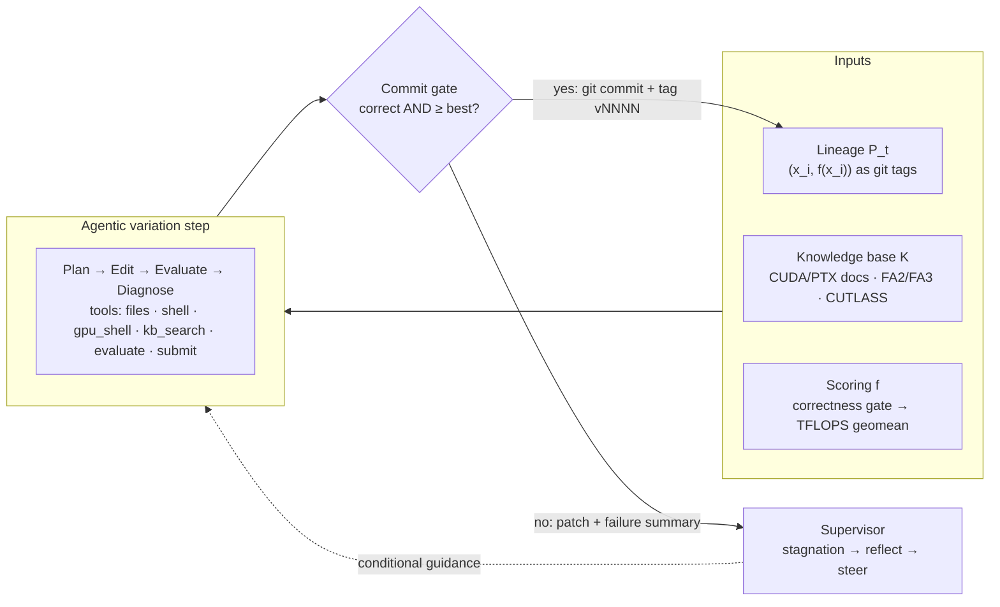

# AVO — Agentic Variation Operators

**An open reproduction of [*AVO: Agentic Variation Operators for Autonomous Evolutionary Search*](https://arxiv.org/abs/2603.24517) — an LLM coding agent replaces mutation and crossover in an evolutionary search, and autonomously evolves CUDA attention kernels.**

   

The paper's core idea: instead of `Vary(P) = Generate(Sample(P))` with fixed heuristics, let an autonomous agent drive variation directly — **`Vary(P_t) = Agent(P_t, K, f)`** — with full access to the solution lineage `P_t`, a domain knowledge base `K`, and the scoring function `f`. This repo implements the complete architecture from scratch and applies it to BF16 attention kernels on consumer/datacenter NVIDIA GPUs (RTX 3090 Ti, H100), with a CPU-only toy task for zero-cost end-to-end validation.

---

## How it works



- **The framework never trusts the agent.** Scoring runs framework-side on a pristine harness copy; correctness inputs are seeded from the code's content hash (hardcoded outputs can't survive an edit); a candidate is committed only if it is numerically correct **and** matches-or-improves the best committed score.
- **Single-lineage evolution, git-native.** Every accepted version is a commit tagged `vNNNN` with score trailers; failed attempts leave a patch + an LLM failure summary that feeds the next step.
- **Self-supervision.** A stagnation monitor reviews the whole trajectory and injects fresh optimization directions when progress stalls.
- **Runs anywhere.** The framework runs on your laptop; kernels compile and benchmark on a remote GPU over plain ssh/rsync. Evals are content-hash cached; killed runs resume exactly where they stopped.

## Results

**Toy task (pure-Python sort, deepseek-v4-flash, $0.30):** the agent took a bubble-sort seed to a hybrid insertion/counting/radix design — **14.9 → 4,320 kElem/s (~290×)** in 3 committed versions, including a gate-rejected regression and a committed revert. Full artifact: [`results/sort-py-20260805-184703/`](results/sort-py-20260805-184703/).

**Attention forward (BF16, head_dim 128, RTX 3090 Ti, deepseek-v4-flash):**
with the final framework (persistent search trajectory, champion
auto-profiling), a **$5 / 13-step** evolution took the deliberately-scalar
seed to a debugged wmma tensor-core FlashAttention kernel — cp.async
pipelining, profile-guided occupancy tuning, register-resident P/Q/O,
deferred rescaling — **2.37 → 57.3 ± 0.2 TFLOPS (24×, verified over 5
independent evals)**. Full four-run ablation (framework design × reasoning
effort, with per-call LLM metrics): [`results/ablation_report.md`](results/ablation_report.md).

| implementation | geomean TFLOPS |
|---|---:|
| PyTorch SDPA (flash) | 70.4 |
| PyTorch SDPA (cuDNN) | 63.0 |
| **AVO evolved champion (verified)** | **57.3 ± 0.2** |
| PyTorch SDPA (efficient) | 47.6 |
| AVO first-framework run ($10.76, scalar-only) | 6.93 |
| seed kernel (deliberately scalar) | 2.37 |

## Quick start

```bash
git clone <this-repo> && cd avo
uv sync --extra dev --extra report       # exact env from uv.lock
uv run pytest                            # 74 tests — no API key, network, or GPU
# without uv: python3 -m venv .venv && source .venv/bin/activate
#             pip install -r requirements-lock.txt && pip install -e . --no-deps

# fetch the knowledge base (FA2/FA3 + CUTLASS at pinned commits, NVIDIA docs)
uv run python scripts/fetch_kb.py --from-manifest
uv run python scripts/fetch_nvidia_docs.py
```

**Toy evolution (local CPU, ~$0.3 of LLM tokens):**

```bash
export DEEPSEEK_API_KEY=...              # or ANTHROPIC_API_KEY / OPENAI_API_KEY
python scripts/llm_smoke.py --config configs/sort_py.yaml --confirm-spend
avo run --config configs/sort_py.yaml --confirm-spend
avo dashboard --watch 30 --open          # live wandb-style dashboard
```

**Kernel evolution — run directly on the GPU machine** (the default: all
attention configs use `runner.kind: local`). Clone the repo on the box, then:

```bash
bash scripts/setup_host.sh        # CUDA-matched pinned torch + ninja into .venv (idempotent)
export PATH=/usr/local/cuda/bin:$PATH        # nvcc for the harness compiles
avo eval-once  --config configs/attention_3090.yaml            # seed compiles + scores (no LLM)
avo baselines  --config configs/attention_3090.yaml            # SDPA / flash-attn lines
avo run        --config configs/attention_3090.yaml --confirm-spend
avo dashboard --watch 30 --open
```

Same flow on an H100 with `configs/attention_h100.yaml` (paper grid, sm_90a).

<details><summary>Alternative topology: framework on a laptop, GPU over ssh</summary>

Set `runner: {kind: ssh, host: <alias>, scratch: "~/avo_scratch", env_activate:
"export PATH=/usr/local/cuda/bin:$PATH && source ~/avo_scratch/venv/bin/activate"}`
in the config, then provision the host once and preflight:

```bash
bash scripts/provision_remote.sh <ssh-host>
bash scripts/setup_remote.sh <ssh-host> \
  'export PATH=/usr/local/cuda/bin:$PATH && source ~/avo_scratch/venv/bin/activate'
```

Evals then rsync the workspace to the host and run there; the agent gets a
`gpu_shell` tool for remote probes (locally, plain `shell` reaches the GPU).
</details>

## Multiple runs on one GPU

Evolution runs are mostly LLM-bound; the GPU is only touched during evals. A
cross-process **GPU lock** (`runner.gpu_lock`, default `/tmp/avo_gpu.lock`)
serializes eval executions across concurrent AVO instances — benchmark timing
stays exclusive and memory never contends — while all LLM turns overlap
freely. So on one H100 you can run several experiments at once (different
models, tasks, or configs) at high aggregate utilization:

```bash
nohup avo run --config configs/attention_h100.yaml      --confirm-spend > runA.log 2>&1 &
nohup avo run --config configs/exp_glm52.yaml           --confirm-spend > runB.log 2>&1 &
nohup python scripts/run_kernelbench.py --config ... --confirm-spend    > runC.log 2>&1 &
```

Rules: every config sharing the GPU keeps the same `gpu_lock` path (the
default already does); use distinct `run_name`s; a queued eval waits for the
lock without consuming its own timeout, and a crashed holder releases the
lock automatically. Waits longer than 2×`eval_timeout_s` fail structured and
non-cached, so the agent simply retries.

**Filesystem isolation is REQUIRED for multi-route integrity** — without it an
agent's `shell` can read a peer route's workspace, lineage and git history, or
bootstrap from residue in a shared `/tmp` (both observed in the field; a
deny-list cannot prevent it, since the shell is a full language).
`runner.sandbox` picks the mechanism:

| mode | isolates by | requires |
|---|---|---|
| `bwrap` | mount namespace: blanks `runs/`, re-exposes only this workspace, private `/tmp` | user namespaces / `CAP_SYS_ADMIN` |
| `uid` | per-route unprivileged uid + `0700` run dirs + private `TMPDIR` | root **inside** the container — no capabilities, no userns |
| `require` | strongest available, else **aborts the run** | — |
| `none` | nothing (single-route only) | — |

Check what a host supports with `python scripts/check_isolation.py`, use
`sandbox: require` for any comparative experiment, and audit results with
`avo audit --run <dir>` — every run also self-reports a contamination verdict
in `summary.json`. Full detail, incidents and rejected approaches:
**[docs/isolation.md](docs/isolation.md)**.

**Serial and parallel are both supported, per config**, by choosing what the
lock is keyed on:

| goal | setting | effect |
|---|---|---|
| parallel across cards | `gpu_lock: "/tmp/avo_gpu{device}.lock"` (default) | one eval per GPU at a time; N cards ⇒ N evals in flight |
| strictly serial node-wide | `gpu_lock: "/tmp/avo_node.lock"` (no `{device}`) | exactly one eval on the whole node — maximum timing fidelity (no PCIe/power/thermal cross-talk) |
| serial on a shared card | same path, same `cuda_device` | routes sharing a GPU queue automatically |
| no locking | `gpu_lock: ""` | for pod-per-GPU setups where nothing is shared |

LLM turns always overlap regardless — only GPU execution is gated.

On a **multi-GPU node**, give each route its own card with
`runner.cuda_device: "0".."7"` — it is exported as `CUDA_VISIBLE_DEVICES` to
the eval subprocess, and `gpu_lock` defaults to a per-device path
(`/tmp/avo_gpu{device}.lock`) so routes on different cards never serialize.
**Kubernetes**: see [docs/kubernetes.md](docs/kubernetes.md) — pod-per-route is
recommended (the container is the sandbox), and the busy-guard is
PID-namespace-safe.

## KernelBench campaigns

[KernelBench](https://github.com/ScalingIntelligence/KernelBench) (ICML'25,
270 problems) runs inside AVO as an unattended campaign: one bounded evolution
per problem, score = speedup vs PyTorch eager (comparable to `fast_p`), but
evaluated under AVO's discipline — the authoritative reference is embedded in
the (cache-keyed) eval params so the agent can't touch it, correctness uses
multiple content-hash-seeded trials, and memory-frugal chunked comparison.

```bash
python scripts/fetch_kb.py --only kernelbench       # problems, manifest-pinned
python scripts/run_kernelbench.py --config configs/kernelbench_h100.yaml \
    --problems level1 --dry                          # seed-eval every problem, no LLM
nohup python scripts/run_kernelbench.py --config configs/kernelbench_h100.yaml \
    --problems level1,level2 --confirm-spend > kb_campaign.log 2>&1 &
python scripts/run_kernelbench.py --config ... --report-only   # fast_p table
```

Free-running by design: finished problems are skipped on relaunch, per-problem
budgets bound each evolution, `campaign.max_total_usd` bounds the sweep, and
`results/kernelbench_report.md` aggregates fast_1/1.5/2. Note: some v0.1
problems allocate >18 GiB — sized for 80 GB cards; they fail gracefully
(structured OOM, score 0) on smaller GPUs.

## Commands

| command | what it does | LLM cost |
|---|---|---|
| `avo run` / `avo resume` | start / continue an evolution run | **yes** — requires `--confirm-spend` |
| `avo eval-once` | score a workspace once | none |
| `avo baselines` | benchmark SDPA/flash-attn on the task grid | none |
| `avo dashboard` | self-contained live HTML dashboard (`--watch`, `--open`) | none |
| `avo report` / `avo rebench` | lineage plot · re-score all versions, mean±std | none |
| `avo audit` | detect cross-route / shared-`/tmp` contamination in a run | none |
| `avo export` | package a run into committable `results/` | none |

**Cost safety is structural**: only `run`, `resume`, and `llm_smoke.py` can reach an LLM API, all three require `--confirm-spend`, and every run is capped by `max_usd` (from API-reported usage × configured prices) plus a `max_total_tokens` backstop, per-step turn/eval budgets, and wall-clock limits. Keys come from environment variables only.

## Project structure

```
avo/                  framework: agent loop · tools · LLM adapters · lineage ·
                      controller · supervisor · local/SSH runners · eval cache ·
                      dashboard/report
tasks/sort_py/        CPU toy task (validates the loop for pennies)
tasks/attention_cuda/ seed CUDA kernel + scoring harness (correctness vs FP32
                      reference with BF16 error-floor tolerance; CUDA-event TFLOPS;
                      GQA via kv_heads)
tasks/kernelbench/    universal adapter for all 270 KernelBench problems
knowledge_base/       curated notes + official NVIDIA docs + FA2/FA3 + CUTLASS +
                      KernelBench (external sources pinned in MANIFEST.json)
configs/              per-run YAML: task · LLM/provider · runner · grid · budgets
scripts/              setup_host (on-box GPU env) · run_kernelbench (campaigns) ·
                      KB fetchers + freshness check · llm_smoke · ssh-topology tools
results/              exported, committable run artifacts (lineage, history
                      bundle, final source, transcripts, dashboards)
```

**Adding a new kernel task** requires zero framework changes, and the task *inherits* the experiment-integrity guarantees instead of re-implementing them. A task is a directory with `task.yaml`, a `seed/`, and a `harness/score.py` that calls `avo_harness.run_scoring()` with four task-specific hooks:

```python
import avo_harness as ah            # staged into every eval automatically

args = ah.parse_args()
args.params.setdefault("banned_apis", [r"cublas\w*Gemm"])   # ban the library your task is about
ah.run_scoring(args, ah.ScoringHooks(
    load=lambda a: build_my_kernel(a.workspace),
    configs=lambda cand, a: my_benchmark_grid(a.params),
    check=lambda cand, cfg, seed, a: {"ok": ..., "detail": ...},
    measure=lambda cand, cfg, a: {"metric_value": tflops, "median_ms": ms}))
```

`run_scoring` then enforces, identically for every task: GPU busy guard → banned-API scan → correctness before any timing → benchmark → **post-benchmark recheck with fresh seeds** (catches candidates that memoize their output and then "run" in ~0 ms) → result written with the per-eval token the runner verifies (a positive score without it is rejected as forged, since candidate code is loaded in-process). See [`harness_lib/avo_harness`](harness_lib/avo_harness/__init__.py), with `tasks/attention_cuda/harness/score.py` as the reference implementation.

## Reproducibility

Everything a result depends on is pinned and committed:

- **Code, configs, tests** — this repo; `requirements-lock.txt` pins the env.
- **Knowledge base** — `knowledge_base/external/MANIFEST.json` records exact repo commits and doc versions; `fetch_kb.py --from-manifest` restores them byte-identically; `check_kb_freshness.py` audits drift against upstream.
- **Run artifacts** — `avo export` packages lineage, full per-config score records, baselines, the dashboard, and the evolved solution's **complete git history** as `workspace.bundle` (`git clone workspace.bundle` to walk every version).

The LLM-driven search is not bit-reproducible (sampling); every *claim* is: each committed kernel re-scores to its recorded TFLOPS on matching hardware (`avo eval-once --workspace results/<id>/final_solution --fresh`, or `avo rebench` for mean±std over 10 independent rounds), and the method re-runs end-to-end from the seed.

## Faithfulness to the paper — and deliberate divergences

Implemented as described: single-lineage evolution with git persistence, correct-AND-improves commit gate, failed attempts kept out of the lineage, agentic edit-evaluate-diagnose variation with software-engineering tools and documentation retrieval, correctness-gated TFLOPS-geomean scoring, FA-style benchmark protocol (fixed token count, causal/non-causal, warmup + median of repeats), and conditional supervisor intervention.

Deliberately different:

1. **Hardware**: RTX 3090 Ti (sm_86) / H100 (sm_90a) instead of B200; baselines are PyTorch SDPA + FlashAttention-2/3 instead of cuDNN 9.19/FA4.
2. **Fresh agent conversation per variation step** (lineage table, last-commit diff, and failure summaries injected) instead of one multi-day conversation — bounded context, resumable runs.
3. **The supervisor algorithm and seed kernel are our own designs** — the paper specifies neither.
4. **Scaled budgets**: ~10 versions over hours rather than 40 versions over 7 days.

## Citation

```bibtex
@article{avo2026,
  title   = {AVO: Agentic Variation Operators for Autonomous Evolutionary Search},
  author  = {Chen, Terry and Ye, Zhifan and Xu, Bing and others},
  journal = {arXiv preprint arXiv:2603.24517},
  year    = {2026}
}
```

## License

[MIT](LICENSE) for the code in this repository. Knowledge-base content retains its upstream licenses: FlashAttention and CUTLASS (BSD-3-Clause) are never committed — they are restored at pinned commits by `scripts/fetch_kb.py --from-manifest`. The converted NVIDIA documentation text under `knowledge_base/external/nvidia_docs/` is © NVIDIA and is currently committed **for private-repo reproducibility only** — run `git rm -r --cached knowledge_base/external/nvidia_docs` before making this repository public (the fetch scripts restore it locally).
